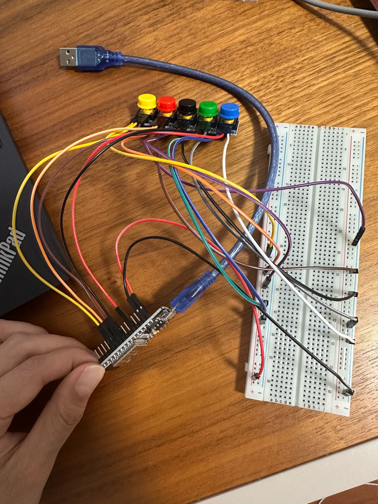

# Day 2: Button Input for Activity Logging (May 20, 2025)

## Goals:
* Add multiple buttons for logging different baby care events
* Log each event with a real timestamp using onboard buttons
* Enable WiFi + NTP time sync for accurate real-world timing
## Hardware:
* ESP32-WROOM-32 (DOIT DevKit V1)
* 5x push-button modules (active-high, Arduino-compatible)
* Wired to: GPIO 4, 5, 18, 19, 21 (D4, D5, D18, D19, D21 on board)
- 
## Implemented Features:
* **WiFi setup** using credentials
* **NTP time sync** with timezone offset for GMT+8
* **Button logger**:
  * Monitors 5 GPIO pins
  * Logs button press with **timestamp**
  * Example output:

    ```
    📌 Yellow button pressed at 2025-05-19 19:20:31
    📌 Black button pressed at 2025-05-19 19:20:38
    ```
## Code Summary:
* Button pins are declared in an array of structs
* Loop checks for state change (debounced)
* Time is retrieved using `getLocalTime()`, formatted via `strftime()`
* Logs are printed to the serial monitor

```cpp
#include <Arduino.h>
#include <WiFi.h>
#include <time.h>


const char* ssid = "###"; // Replace with your WiFi SSID
const char* password = "###"; // Replace with your WiFi password

const char* ntpServer = "pool.ntp.org"; // NTP server
const long gmtOffset_sec = 8 * 3600; // GMT offset in seconds, GMT+8 for China
const int daylightOffset_sec = 0; // No daylight saving time


void connectToWiFi() {
  Serial.print("Connecting to WiFi");
  WiFi.begin(ssid, password);
  while (WiFi.status() != WL_CONNECTED) {
    delay(1000);
    Serial.print(".");
  }
  Serial.println("Connected to WiFi");
  Serial.println(WiFi.localIP());
}

void setupTime() {
  configTime(gmtOffset_sec, daylightOffset_sec, ntpServer);
  Serial.println("Waiting for NTP time sync...");
  time_t now = time(nullptr);
  while (now < 8 * 3600 * 2) { // Wait for time to be set
    delay(1000);
    Serial.print(".");
    now = time(nullptr);
  }
  Serial.println("NTP time sync complete");
}
struct Button {
  const char* name; // Name of the button
  int pin; // Pin number for the button
  int state; // Current state of the button
};

Button buttons[] = {
  {"Blue", 4, LOW},
  {"Red", 19, LOW},
  {"Green", 5, LOW},
  {"Yellow", 21, LOW},
  {"Black", 18, LOW}
};

void setup() {
  Serial.begin(115200); // Initialize serial communication at 115200 bps
  connectToWiFi(); // Connect to WiFi
  setupTime(); // Setup time using NTP
  for (auto &bn : buttons) {
    pinMode(bn.pin, INPUT);
  }
  Serial.println("Setup complete. Waiting for button presses...");
}

void loop() {
  for (auto &bn : buttons) {
    int currentState = digitalRead(bn.pin); // Read the current state of the button
    if (currentState != bn.state) { // Check if the state has changed
      bn.state = currentState; // Update the state
      if (currentState == HIGH) { // Button pressed
        struct tm timeinfo;
        if (getLocalTime(&timeinfo, 1000)) {
          char timeString[64];
          strftime(timeString, sizeof(timeString), "%Y-%m-%d %H:%M:%S", &timeinfo);
          Serial.printf("📌 %s button pressed at %s\n", bn.name, timeString);
        } else {
          Serial.printf("📌 %s button pressed, but failed to get time\n", bn.name);
        }
      }
    }
  }

  delay(100); // debounce
}
```
## Results:
* Real-time activity logging using physical buttons
* NTP time accuracy achieved
* No external clock or display required yet
## Next Step – Day 3 Planning & Use Case Design

### Project Use Case: Baby Care Event Tracker
Your goal: help caregivers **log**, **track**, and **analyze** daily baby activities — easily and without a phone during the moment.
### Daily Tracked Events
* 🍼 **Feeding** (track frequency + time)
* 💩 **Poop** / 💦 Pee
* 😴 **Sleep/Nap start** (future: long press = end?)
* 🛁 **Bath**
* 🧼 Add-ons: diaper changes, medication, crying, etc.
### Future Core Features:
| Feature               | Description                                                          |
| --------------------- | -------------------------------------------------------------------- |
| 📦 Local Storage      | Store events in flash memory (e.g. SPIFFS or LittleFS) as a log file |
| 📱 Mobile Interaction | WiFi AP mode or web interface to download/view logs                  |
| 📈 Data Analysis      | Count daily events, visualize feeding times                          |
| ⏰ Alerts             | E.g. alert if no feeding in last 3 hrs (for newborns)                |
| ⌛ Long Press Support | Log start and stop of activities (e.g. sleep duration)               |
| 📺 Display (Optional) | OLED to show time + next feeding reminder                            |
| 🔋 Battery Monitoring | Show power state or charge level if mobile                           |
### 🛠️ Tech Implementation Options
| Option                                  | Pros                                          | Cons                                                       |
| --------------------------------------- | --------------------------------------------- | ---------------------------------------------------------- |
| **Onboard Web Server** (via ESP32 WiFi) | No extra hardware; view logs on phone browser | Requires local connection; may be harder to maintain state |
| **Bluetooth / BLE**                     | Native phone connectivity                     | More complex firmware                                      |
| **MQTT + Cloud Logging**                | Remote access, live monitoring                | Needs always-on internet                                   |
| **Display + Buzzer**                    | Works offline, compact                        | Limited interaction unless paired with app                 |
| **ESP32-CAM Version**                   | Add photo/QR scan of baby bottle              | More complex power and size management                     |
### Suggested Next Step (Day 3):
> **"Store logs persistently in SPIFFS filesystem"**
Why? Right now, logs are only printed. If you unplug, they're gone.
📦 Tomorrow’s goal:
* Save each log line to a file (`log.txt`)
* One line per event with timestamp + activity
* View logs via serial or basic web interface later
