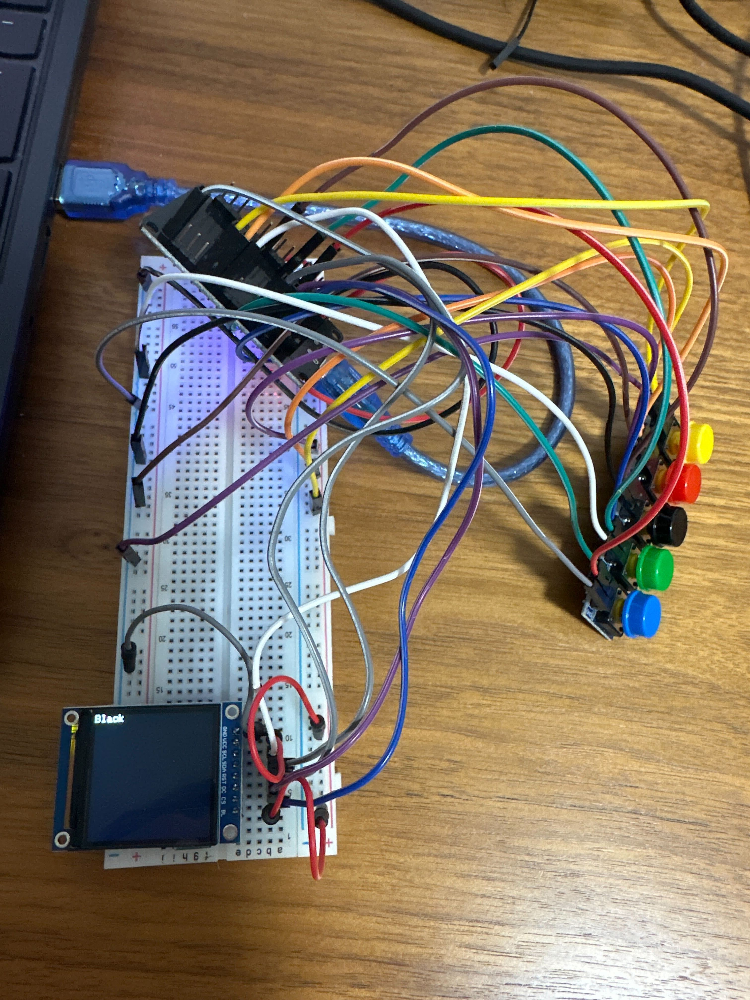

# Day 6 - Improments for Button Handling

## Summary of Accomplishments

- Fixed **Blue + Black combo** not allowing single-button events:
  - Moved `preStates` updates to the end of `loop()` to correctly detect new presses.
  - Ensured single Blue or Black presses are logged if not part of the combo.
- Improved **Red + Yellow combo logic**:
  - Added delayed logging: If Red and Yellow are pressed within 200ms of each other, log only `Pee-Poo`.
  - Prevented redundant logs for individual Red or Yellow in combo cases.

### Button Press Behavior
| Button Combo         | Behavior                              |
|----------------------|---------------------------------------|
| 🔵 Blue (alone)      | Logs "Blue" (for sleeping)            |
| ⚫ Black (alone)     | Logs "Black" (for stop sleep/feed)    |
| 🔵 + ⚫ Blue+Black   | Clears all `.txt` log files           |
| 🔴 Red (alone)       | Logs "Red" (after 200ms delay, poo)   |
| 🟡 Yellow (alone)    | Logs "Yellow" (after 200ms delay, pee)|
| 🔴 + 🟡 Red+Yellow   | Logs "Pee-Poo" and suppresses singles |
| 🟢 Green             | Logs "Green" (for feeding)            |

### UI Feedback
- Updated `showOnDisplay()` messages:
  - "Logs cleared" on combo clear
  - "Pee-Poo", "Red", "Yellow", or individual colors on valid press

## Code Changes

### `loop()` function
- Rewrote logic to:
  - Track and handle individual press timestamps
  - Detect and suppress unwanted logs based on temporal proximity
  - Maintain previous button states for edge-triggered detection

### Other Improvements
- Cleaned up logic flow for clarity and maintainability
- Added section-wise comments for easier navigation
---
- 
